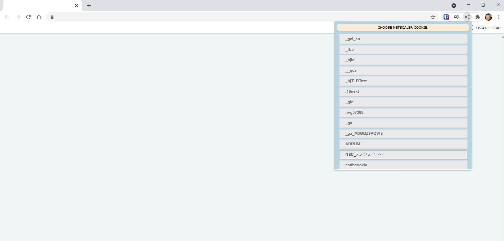

## Citrix Netscaler Cookie Decoder - Chrome Extention
Citrix Netscaler Load Balancer uses an encoded cookie to maintain stateful connections from client to server. These cookies are automatically sent in every request to the domain that set them. This allows a simple way to track each client’s server association for load balancing control.

This chrome extension reverse the Netscaler algorithm used to encode the data, and exposes the IP address and TCP port of the host that is actually handling your connection. It is based on the work of [catalyst256][catalyst256link] and is intend to to help developers and administrators in trobleshooting situations. 

* [GitHub repository][link2]

* [Netscaler Cookie Decryptor by @catalyst256][link1]

### Screenshot

 

 
 <em>(to my love @tamiresdias)</em>

[link1]: <https://github.com/catalyst256/Netscaler-Cookie-Decryptor>
[link2]: <https://github.com/joaofelipes/netscaler-cookie-decoder>
 [catalyst256link]: <https://github.com/catalyst256/Netscaler-Cookie-Decryptor/commits?author=catalyst256>